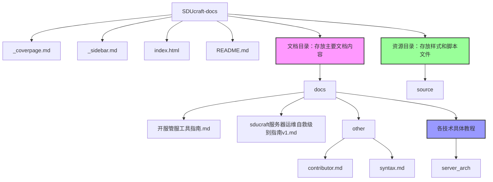

# SDUcraft-docs  

author@matcha

**山东大学Minecraft社团技术文档库**  
*技术传承·创新分享·兴趣联结*  

## 项目简介  

SDUcraft-docs 是山东大学Minecraft社团（SDU Minecraft Club）的官方技术文档仓库，旨在鼓励社团技术部成员（服务器开发/维护者、插件开发者等）分享游戏服务器中**创新性技术实现、核心代码模块解析及架构设计思路**。  

本仓库面向全体社团成员、其他高校MC社团技术爱好者，致力于构建一个开放的技术交流平台，助力技术经验沉淀与迭代传承，激发创新思维，促进跨校MC技术社区的兴趣联结与共同成长。  

## 目录  

- [关于本仓库](#关于本仓库)  
- [文档内容指南](#文档内容指南)  
- [贡献流程](#贡献流程)  
- [文档规范](#文档规范)  
- [社区与交流](#社区与交流)  
- [许可证](#许可证)  

## 关于本仓库  

### 仓库文件结构



### 🌟 核心目标

我们希望通过SDUcraft-docs实现：  

- **技术迭代传承**：沉淀服务器开发/维护过程中的关键技术细节，避免经验流失，帮助新成员快速上手，保障技术栈的持续迭代；  
- **技术开放分享**：打破信息壁垒，让全体社员及其他高校MC社团成员了解SDUcraft服务器的创新实践，促进技术思路碰撞；  
- **创新驱动发展**：鼓励技术部成员提炼创新性解决方案，如自定义玩法、性能优化、架构设计，推动服务器技术边界探索；  
- **兴趣交流联结**：以技术文档为纽带，联结对MC技术开发感兴趣的社员与跨校同好，分享热爱，共同进步。  

## 文档内容指南  

技术部成员可围绕以下方向贡献文档，包括但不限于：  

### 📌 推荐分享内容

- **服务器架构设计**：如游戏内热切换服务器、分布式负载均衡方案、高可用集群设计等；  
- **核心插件开发**：自定义插件的功能实现，如游戏内fakepeace轻松管理、ledger扩展区块黑名单功能等技术及代码解析；  
- **性能优化实践**：针对高并发场景的优化方案，如红石负载控制、实体管理策略、数据库查询优化、内存泄漏修复等；  
- **创新玩法实现**：非传统玩法的技术落地，如剧情驱动服、小游戏服等核心逻辑解析；  
- **踩坑与经验总结**：开发/维护过程中遇到的技术难题、解决方案及反思，如第三方API对接、版本迁移兼容性处理等。  

## 贡献流程

欢迎技术部成员积极贡献文档，流程如下：  

1. **Fork 本仓库**：点击右上角 Fork 按钮，将仓库复制到个人GitHub账号；  
2. **创建分支**：基于 `main` 分支创建个人贡献分支，命名建议：`feature/[文档主题]-[你的名字]`（例：`feature/redstone-optimization-zhangsan`）；  
3. **编写文档**：按 [文档规范](#文档规范) 撰写内容，存放于 `docs/` 目录下的对应主题的子目录，如 `docs/plugin-dev/`、`docs/performance/`。如果没有对应主题的子目录，可以新建一个；  
4. **提交 PR**：完成后提交 Pull Request 至本仓库 `main` 分支，标题注明文档主题，描述中简要说明内容亮点；  
5. **审核与合并**：技术部核心成员将审核文档内容，通过后合并至主分支。  

## 文档规范

为确保文档可读性与一致性，请遵循以下规范：  

### 📝 格式要求  

- 使用 **Markdown** 格式编写，文件名统一为英文/拼音（例：`redstone-load-optimization.md`）；  
- 标题层级：一级标题（`#`）仅用于文档大标题，二级（`##`）用于核心章节，三级（`###`）用于子主题，以此类推；  
- 代码块：使用 ```[语言]``` 包裹代码（例：```java、```yaml），并添加简要注释说明功能；  
- 配图：如需插入图片，请存放在与你的文档同级目录的`assets`文件夹中，例如文档目录为`docs/plugin-dev/carpet-addtion/readme.md`，那么图片放置在`docs/plugin-dev/carpet-addition/assets/`。

### 📌 内容建议  

- **结构清晰**：建议包含「概述（背景/目标）→ 技术细节（实现思路/核心代码）→ 效果/总结 → 未来优化方向」；  
- **突出创新**：重点说明方案的独特性（如与传统方案的差异、解决的核心问题）；  
- **面向读者**：兼顾技术与非技术读者，复杂概念可配类比或示例说明。  

## 社区与交流  

- **跨校交流**：欢迎其他高校MC社团成员通过 Issue 提问/交流，我们将定期回复；  

## 许可证  

本仓库文档采用 **MIT 许可证**（[MIT License](LICENSE)），允许自由复制、修改、分发，前提是保留原作者信息与许可证声明。  

## 致谢  

感谢山东大学Minecraft社团技术部全体成员的技术沉淀与创新实践，以及所有支持SDUcraft服务器发展的社团伙伴！  

*让技术因分享而闪耀，让热爱因交流而延续 ✨*  

---  
**山东大学Minecraft社团 | SDU Minecraft Club**  
*2025年11月*
